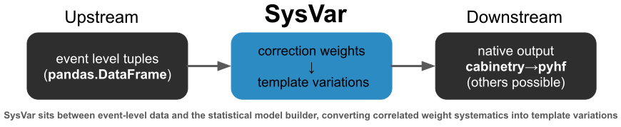

======
SysVar
======

.. note::

    The code repository is available on `gitlab <https://gitlab.desy.de/itsaklid/sysvar>`_

**SysVar** is a Python package that streamlines the treatment of systematic uncertainties for collider-physics analyses that rely on Monte-Carlo *template* fits. It was originally developed within the Belle II context, but its design and interfaces are experiment-agnostic.

In a typical HEP measurement, the observed dataset is a mixture of multiple physical processes. To extract the contribution of any particular process, one builds a statistical model that compares the observed data to the theoretical expectations. When these expectations cannot be expressed with analytical PDFs, non-parametric templates from MC simulation are used instead. This is the standard Monte-Carlo template-fit approach (MC-template fit) [1]_.

MC prediction, however, is never used raw. Event-by-event correction weights are applied to account for effects such as detector response and calibration, physics reweighting, reconstruction efficiencies etc. These correction weights have systematic uncertainties. They affect both

    - the normalisation of a template (total yield)
    - the shape of a template (bin-to-bin correlations within and across templates)

If fits span multiple channels, multiple templates, multiple observables — keeping book of all correlations becomes non-trivial. Analysts either over-approximate (inflating uncertainties) or lose correlations (biasing the fit). SysVar solves this by providing an end-to-end, consistent machinery to build template histograms and their systematic variations with correlations preserved.

`pyhf`_ is now widely used in HEP as the backend for template fits. At present, `pyhf`_ allows nuisance parameters to be fully correlated across bins (via `histosys <https://pyhf.readthedocs.io/en/v0.7.2/likelihood.html#correlated-shape-histosys>`_ modifiers), but it does not provide a native mechanism for encoding partial bin-to-bin correlations arising from systematic variations applied at the event level. 

A standard way to recover these correlations is the following:

|    - build the covariance matrix of the systematic variations over the full template space
|      ``(all channels × all templates × all bins)``
|    - diagonalise this covariance matrix

The resulting eigenvectors (“principal components”) capture the correlation patterns in how the template shapes are modified by systematic effects. Each eigenvariation can then be implemented as a fully correlated nuisance parameter in `pyhf`_.

SysVar provides tools to:

1. apply data/MC correction weights to a dataframe
2. construct systematic variations of those correction weights
3. histogram MC events into nominal and varied templates
4. construct and diagonalise the full covariance matrix in the space (channels × templates × bins)
5. produce orthogonal eigenvariations (“eigendirections”) for use in downstream fits
6. determine how many eigenvariations are actually needed to faithfully represent the full systematic space (compression / truncation)

Why this matters:

- preserves correlations exactly
- reduces the manual bookkeeping burden
- enables natural scaling to large analyses (many channels, many templates)
- enables combining different analyses within a unified workflow

SysVar is intended as a drop-in tooling layer between downstream and upstream tasks as described in the graphic below:

The following pages walk you through using SysVar step-by-step.

Contents
========

.. toctree::
   :maxdepth: 2
   :titlesonly:

   Installation <installation>
   Usage <usage>
   Input to pyhf/cabinetry <input_to_pyhf_cabinetry>
   Module Reference <api/modules>
   Contributions & Help <contributing>
   Authors <authors>

Indices and tables
==================

* :ref:`genindex`
* :ref:`modindex`
* :ref:`search`

.. _toctree: https://www.sphinx-doc.org/en/master/usage/restructuredtext/directives.html
.. _reStructuredText: https://www.sphinx-doc.org/en/master/usage/restructuredtext/basics.html
.. _references: https://www.sphinx-doc.org/en/stable/markup/inline.html
.. _Python domain syntax: https://www.sphinx-doc.org/en/master/usage/restructuredtext/domains.html#the-python-domain
.. _Sphinx: https://www.sphinx-doc.org/
.. _Python: https://docs.python.org/
.. _Numpy: https://numpy.org/doc/stable
.. _SciPy: https://docs.scipy.org/doc/scipy/reference/
.. _matplotlib: https://matplotlib.org/contents.html#
.. _Pandas: https://pandas.pydata.org/pandas-docs/stable
.. _Scikit-Learn: https://scikit-learn.org/stable
.. _autodoc: https://www.sphinx-doc.org/en/master/ext/autodoc.html
.. _Google style: https://google.github.io/styleguide/pyguide.html#38-comments-and-docstrings
.. _NumPy style: https://numpydoc.readthedocs.io/en/latest/format.html
.. _classical style: https://www.sphinx-doc.org/en/master/domains.html#info-field-lists
.. _pyhf: https://pyhf.readthedocs.io/en/v0.7.6/index.html
.. [1] https://www.sciencedirect.com/science/article/pii/0167508784900164
.. _cabinetry: https://cabinetry.readthedocs.io/en/latest/index.html