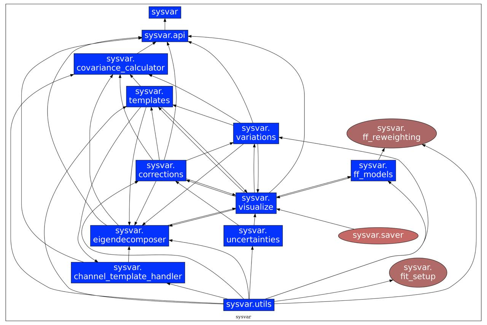

.. _information_for_analysts:

========================
Information for anaylsts
========================

**SysVar** is developed to treat the systematic uncertanties of the analysis in a consistent manner. As described in :doc:`Home <index>`, Sysvar streamlines this procedure to preserve the correlations arising in and across the templates due to the various types of :ref:`corrections`.

The covariance between the bins of the signal extraction variable, associated with a particular source of systematic uncertainty can be expressed as

.. math::
    :name: covariance-in-bins
    
    C_{syst}^{ij} = \sum_{v=1}^{N_{v}}\sum_{c=1}^{N_{c}}\sum_{s=1}^{N_{s}}\Gamma_{vcsi}\Gamma_{vcsj}

where :math:`\Gamma_{vcsi}` describes the variation :math:`v` of bin :math:`i` in template :math:`s` in reconstruction channel :math:`c`, with respect to the bin content of the nominal histogram, due to a particular systematic source.
The various variations :math:`v` are typically drawn from distributions that are normally distributed around the nominal correction event weights.
Building the full covariance matrix becomes trivial by extending Eq. :eq:`covariance-in-bins` to all bins.
Then the covariance matrix can be decomposed into its principal components as

.. math::
   :name: decomposition
   
    C_{syst} = VUV^{T} = (V\sqrt{U}) (V\sqrt{U})^{T} = \Gamma^{'}\Gamma^{'T}

where :math:`V` is a matrix describing the eigenvectors and :math:`U` is the diagonalized matrix with the eigenvalues.
Now the eigenvariation is defined as

.. math::
    :name: eigenvariation
    
    \Gamma^{'} = V\sqrt{U}

A covariance matrix :math:`C^{'}_{syst}` can be computed using the eigenvariations from Eq. :eq:`eigenvariation` plugged in Eq. :eq:`covariance-in-bins`.
If all the eigenvariations are considered then the original covariance matrix :math:`C_{syst}` and the new one from the eigendecomposition :math:`C_{syst}^{'}` are completely identical.
Thankfully it is observed empirically that only a handful of orthogonal principal components are necessary to describe the original covariance matrix to a, subjectively defined, acceptable precision.
This significantly reduces the number of nuisance parameters that are needed to be implemented in the signal extraction fit e.g. in *pyhf*. 

The number of eigendirections implemented as nuisance parameters depend on the type of correction being considered. These could be divided in three distinct classes:

1. Fully correlated correction weights: a single dominant eigendirection results in one nuisance parameter in total.
2. Uncorrelated correction weights: each correction weight yields one nuisance parameter corresponding to its own dominant eigendirection.
3. Partially correlated correction weights: the number of relevant dominant eigendirections varies depending on the case.

SysVar has been designed to handle systematics with partial correlations (the third case). While implementing shape systematics for the first two limiting cases is relatively straightforward without SysVar, we still perform the basis transformation to maintain a consistent treatment across all systematics. This also provides a useful cross-check of SysVar’s behavior in these well-understood edge cases.

SysVar internally builds a total covariance matrix from all uncertainty sources that affect the central correction weights. It then draws samples from a multivariate Gaussian defined by this covariance matrix to generate variations of the correction weights. The number of variations is chosen by the user. For each variation, SysVar rebuilds all template histograms using the varied weights instead of the nominal ones.

A subtle but important point: if multiple correction weights must be applied in the same event (e.g. two leptons, both with an LID correction factor, even if those leptons fall in different bins of the correction weight), SysVar uses the same set of varied weight values for both objects in that event (i.e. from the same *toy*). This is essential to correctly propagate the correlations between correction weights into the template variations.

| Once all ``Nvar`` template variations are generated, they are combined into a matrix of shape: ``(channels × templates × bins)  ×  Nvar``.
| Multiplying this matrix by its transpose: 
| ``(channels × templates × bins, Nvar) × (Nvar, channels × templates × bins)``
| yields the full covariance matrix across all bins of the analysis.

As a Python tool, **SysVar** can be explored in detail at each step through its class composition and shallow inheritance structure. However, for most users a simple high-level interface is provided via the :mod:`sysvar.api`, making it easy to integrate all of this directly into an analysis.

The :mod:`sysvar.api` is based on a configuration file that an analyst creates according to their analysis. This is typically in a yaml/json format. The main attributes this file are listed in :ref:`SysVar 101 <sysvar_101>` with a minimal example. For analysis specific corrections and how an analyst can modify them according to their needs, there is an example in :ref:`Correction Playground <notebooks/correction_playground>`.

Many visualization and debugging tools are also provided to make this process more transparent and make it accessible for the analyst to have a full understanding of the various steps as described in the next section. Below you can find the full module dependency graph of SysVar, produced with `pydeps`_.

.. _pydeps : https://github.com/thebjorn/pydeps

